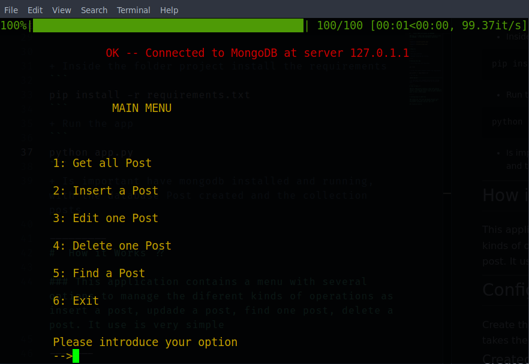

#     Simple CRUD with Python and MONGODB

### This is a simple app using python version 3.10.2 and MONGODB.  A Crud with the basics operations

------


------

# Requires

+ Python 3

+ Have pip installed

+ Mongodb installed and running

------

# Running this App

+ First Step Clone the repository

```
git clone
```

+ Inside the folder project install the requirements
```
pip install -r requirements.txt
```
+ Run the app
```
python app.py
```
+ Is important have mongodb installed and running, with the database Post created and the collection posts

---------
#  How it Works ??



### This application contains a menu with several options to manage the diferent kinds of operations as insert a post, updade a post, find one post, delete a post. It use is very simple

-------

# Configuration to ENV File

### Create the .env file and guide yourself with env-example-file. This litle project takes the enviorments variables from the .env file

## Created by Userlg